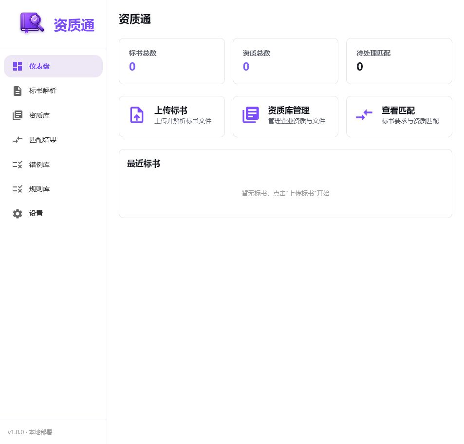
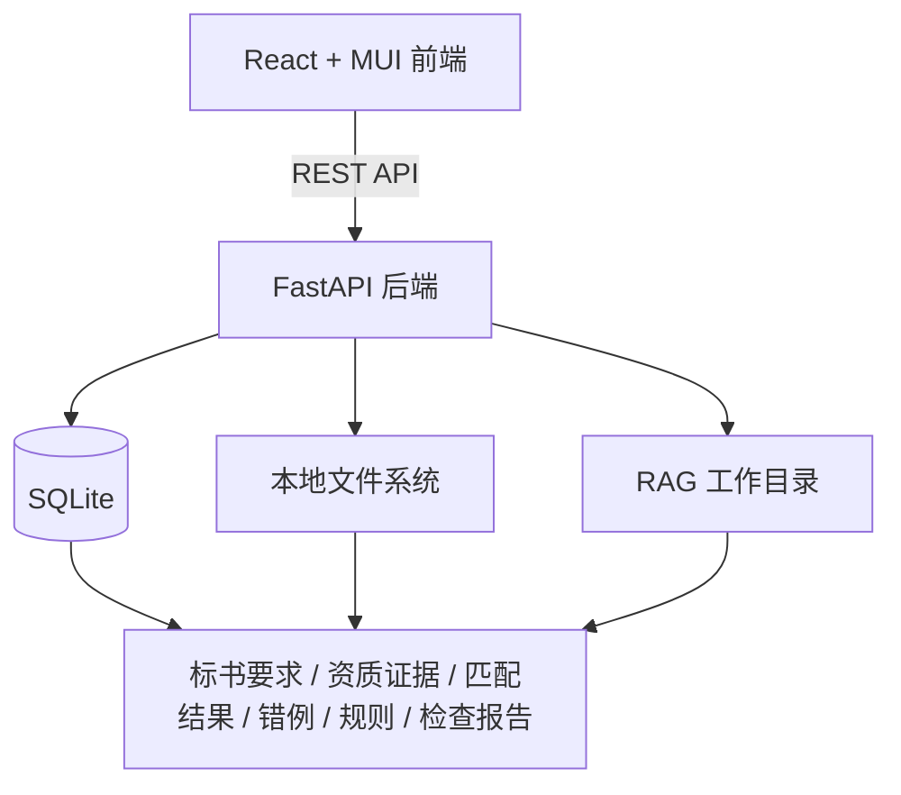

<div align="center">


# 资质通 · RAG-Tender Assistant

**面向招投标场景的本地化 RAG 标书解析与资质匹配助手**

我开源了一个面向招投标场景的本地化 RAG 工作流样例：可以解析标书要求、匹配企业资质证据、标记待确认项，并提醒投标红线风险。

[](./LICENSE)
[](#快速开始)
[](#快速开始)
[](#技术栈)
[](#技术栈)
[](#快速开始)
[](#引用与交流)

[快速开始](#快速开始) · [核心功能](#核心功能) · [架构概览](#架构概览) · [使用流程](#使用流程) · [路线图](#路线图) · [许可证](#许可证)

</div>

<br/>

> 本仓库为脱敏开源版本，**不包含**真实标书、真实资质文件、上传文件、数据库、日志、API Key 或运行期 RAG 工作目录。

## 📑 目录

- [项目背景](#项目背景)
- [界面预览](#界面预览)
- [核心功能](#核心功能)
- [适合参考的方向](#适合参考的方向)
- [架构概览](#架构概览)
- [技术栈](#技术栈)
- [快速开始](#快速开始)
- [使用流程](#使用流程)
- [脱敏与安全说明](#脱敏与安全说明)
- [测试](#测试)
- [项目目录](#项目目录)
- [路线图](#路线图)
- [引用与交流](#引用与交流)
- [许可证](#许可证)

## 项目背景

招投标文件通常篇幅长、格式复杂、要求分散，人工核对容易遇到几个问题：

- 📄 标书要求分散在不同章节，容易漏看关键条款。
- 🔁 企业资质、人员证明、业绩、财务材料之间需要反复比对。
- 🔍 "符合 / 不符合 / 待确认"需要可追溯的证据链，而不是只给一个相似度。
- 🚩 投标保证金、签章、授权书、有效期、报价上限等红线事项需要单独提醒。
- 🗃️ 错例和人工修正如果不能沉淀，系统很难持续改进。

> 资质通的目标不是替代人工决策，而是把**重复阅读、初步归类、证据召回、风险提醒和报告整理**自动化，让人工把精力放在最终判断和风险确认上。

## 界面预览

<div align="center">
  
  <p><sub>资质通本地运行界面：仪表盘、标书解析、资质库、匹配结果、错例库与规则库入口。</sub></p>
</div>

## 核心功能

| 模块 | 说明 |
| --- | --- |
| 📥 **标书上传与解析** | 支持 PDF / DOCX 等文件，解析后生成结构化要求 |
| ✅ **要求核对** | 按资质、业绩、财务、人员、提交件等类别核对和修正 |
| 🗂️ **资质库管理** | 维护企业资质、人员资质、财务资料、业绩项目等证据 |
| 🔎 **资质匹配** | 对标书要求和资质库证据进行候选召回与字段级证据判断 |
| 🛡️ **保守判定** | 缺少关键证据时默认进入"待确认"，避免仅凭相似度误判 |
| 📚 **错例库** | 沉淀人工确认结果，用于复盘误判和补充规则 |
| 📏 **规则库** | 查看内置规则、自定义规则、规则草案、变更记录和候选建议 |
| 🚩 **红线待办** | 识别授权书、投标有效期、报价上限、暗标敏感信息、电子投标提交等重点事项 |
| 📊 **检查报告** | 导出资质匹配总览、不通过项、待确认项、缺失证据、红线待办和检查器结果 |
| 💻 **本地部署** | 前端 React，后端 FastAPI，数据存储使用本地 SQLite |

## 适合参考的方向

这个项目更偏"业务型 RAG 系统样例"，适合参考：

- RAG 如何进入真实业务流程，而不是停留在聊天问答。
- 长文档解析后如何形成结构化业务对象。
- 如何把相似度召回、规则检查、人工确认组合起来。
- 如何为 AI 结果保留证据链和人工纠错入口。
- 如何设计本地化部署的 AI 工具，包括 API Key 加密、本地数据库和前后端分离。

如果你正在做政企文档、招投标、合同审查、资质审核、知识库问答或行业资料核对，本项目中的架构和取舍可能会有参考价值，不是一个聊天机器人，而是一个把 RAG 接进真实业务流程的招投标资质核查样例。

## 架构概览



主要模块：

- `frontend/`：React + Vite + TypeScript + MUI 前端。
- `backend/`：FastAPI 后端、SQLite 初始化、业务服务和 API 路由。
- `docs/assets/`：README 展示资源。
- `samples/`：脱敏样例，禁止放真实业务资料。

## 技术栈

| 层级 | 技术 |
| --- | --- |
| 🎨 前端 | React 18, Vite, TypeScript, MUI, React Router |
| ⚙️ 后端 | Python, FastAPI, Uvicorn, Pydantic |
| 🗄️ 数据 | SQLite, aiosqlite |
| 📄 文档处理 | RAG-Anything, MinerU, OCR, LibreOffice |
| 📎 文件处理 | python-docx, openpyxl, pdfplumber |
| 🚢 部署方式 | Windows 本地部署 |

## 快速开始

### 0. 获取代码

```powershell
git clone https://github.com/HunterLzap/rag-tender.git
cd rag-tender
```

### 1. 准备环境

建议环境：

- Windows 10 / 11
- Python 3.13+
- Node.js 22+
- LibreOffice，并加入系统 `PATH`

### 2. 安装后端依赖

```powershell
cd backend
python -m venv .venv
.\.venv\Scripts\activate
pip install -r requirements.txt
```

### 3. 安装前端依赖

```powershell
cd frontend
npm install
```

### 4. 配置 API Key 加密主密钥

本项目不会把 API Key 写入配置文件。API Key 通过前端设置页保存，并使用 `RAG_TENDER_SECRET_KEY` 加密后写入本地 SQLite。

生成密钥：

```powershell
backend\.venv\Scripts\python.exe -c "from cryptography.fernet import Fernet; print(Fernet.generate_key().decode())"
```

将输出结果配置为 Windows 用户或系统环境变量：

```text
RAG_TENDER_SECRET_KEY=你的生成结果
```

`.env.example` 仅提供占位示例，不包含真实密钥。

### 5. 启动项目

方式一：双击或执行：

```powershell
start.bat
```

方式二：手动启动：

```powershell
# 终端 1：后端
cd backend
.\.venv\Scripts\activate
python run.py

# 终端 2：前端
cd frontend
npm run dev
```

访问：

- 前端：http://localhost:5173
- API 文档：http://127.0.0.1:8000/docs

停止服务：

```powershell
.\_stop_services.bat
```

## 使用流程

1. 打开"设置"，填写 LLM、Embedding、Vision 模型配置。
2. 上传标书，等待解析完成。
3. 在核对页检查并修正结构化要求。
4. 上传企业资质、人员资料、财务资料和业绩文件。
5. 进入"匹配结果"，触发或查看资质匹配。
6. 对待确认项进行人工判断，必要时写入错例库。
7. 在"规则库"查看或维护规则。
8. 导出检查报告，辅助投标前复核。

## 脱敏与安全说明

> ⚠️ **提交前请务必确认**：以下内容不会被上传到公开仓库。

本开源仓库应保留：

- 源码
- 测试
- 文档
- 配置模板
- 脱敏样例
- 启动脚本
- 图标资源

本开源仓库**不应**包含：

- `.env` 或任何真实 API Key
- `data/`、`output/`、`backend/output/`
- SQLite 数据库，如 `*.db`、`*.sqlite`
- 上传文件、真实标书、真实资质、真实企业资料
- 日志、缓存、`__pycache__`
- `frontend/node_modules/`
- `frontend/dist/`
- RAG 工作目录，如 `rag_workspace/`

<details>
<summary>📋 提交前自检脚本（点击展开）</summary>

```powershell
Get-ChildItem -Recurse -Force -ErrorAction SilentlyContinue |
Where-Object {
  $_.Name -ne ".env.example" -and
  $_.Name -match '^\.env($|\.)|\.db$|\.sqlite$|\.sqlite3$|\.log$|node_modules|dist|__pycache__|rag_workspace'
} |
Select-Object FullName
```

没有输出时再提交。

</details>

## 测试

后端关键测试：

```powershell
cd backend
.\.venv\Scripts\python.exe -m unittest discover -s . -p "test_*.py"
```

前端构建：

```powershell
cd frontend
npm run build
```

> 说明：前端构建后会生成 `frontend/dist/` 和 `*.tsbuildinfo`，这些属于构建产物，不应提交到仓库。

## 项目目录

```text
RAG-Tender-Assistant-open-source/
├── backend/                  # FastAPI 后端
│   ├── app/
│   │   ├── api/              # API 路由
│   │   ├── models/           # 数据模型
│   │   ├── schemas/          # 响应结构
│   │   ├── services/         # 核心业务逻辑
│   │   └── utils/            # 工具函数
│   ├── requirements.txt
│   └── test_*.py
├── frontend/                 # React 前端
│   ├── src/
│   │   ├── api/
│   │   ├── components/
│   │   ├── pages/
│   │   └── types/
│   └── package.json
├── docs/assets/              # README 展示资源
├── samples/                  # 脱敏样例
├── start.bat                 # Windows 启动脚本
├── _stop_services.bat        # 停止服务脚本
├── .env.example              # 环境变量示例
└── README.md
```

## 路线图

路线图不是承诺，而是帮助读者理解项目状态和可能的后续方向。

**✅ 已完成**

- [x] 标书上传、解析和要求核对
- [x] 资质库、业绩库、财务资料和人员资料管理
- [x] 资质匹配、保守判定、证据矩阵和待确认机制
- [x] 错例库、规则库和规则变更记录
- [x] 投标红线待办和检查报告导出
- [x] API Key 加密存储和调用日志脱敏
- [x] 本地化前后端启动脚本

**🧭 后续可探索**

- [ ] 更稳定的跨平台部署方式，例如 Docker
- [ ] 更完整的前端自动化测试
- [ ] 更细的规则版本管理和规则效果评估
- [ ] 更强的脱敏样例和演示数据集
- [ ] 面向更多行业文档的规则迁移

## 引用与交流

⭐ 如果这个项目对你的学习、研究、课程、文章或业务原型有帮助，欢迎点个 Star 并引用本仓库链接。

也欢迎通过 Issue 讨论：

- RAG 在业务流程中的落地方式
- 招投标场景的文档解析与证据匹配
- 规则引擎与人工纠错如何结合
- 本地化 AI 工具的安全和部署问题

欢迎提交 Issue 或 PR 参与共建。

[](https://star-history.com/#HunterLzap/rag-tender&Date)

## 许可证

本项目使用 MIT License。详见 [LICENSE](./LICENSE)。

本项目参考并基于 [HKUDS/RAG-Anything](https://github.com/HKUDS/RAG-Anything) 相关能力进行业务化集成，感谢开源社区的基础工作。

<div align="center">
<sub>用 ❤️ 打磨于真实招投标场景 · 欢迎 Star ⭐ 与 Issue 交流</sub>
</div>

