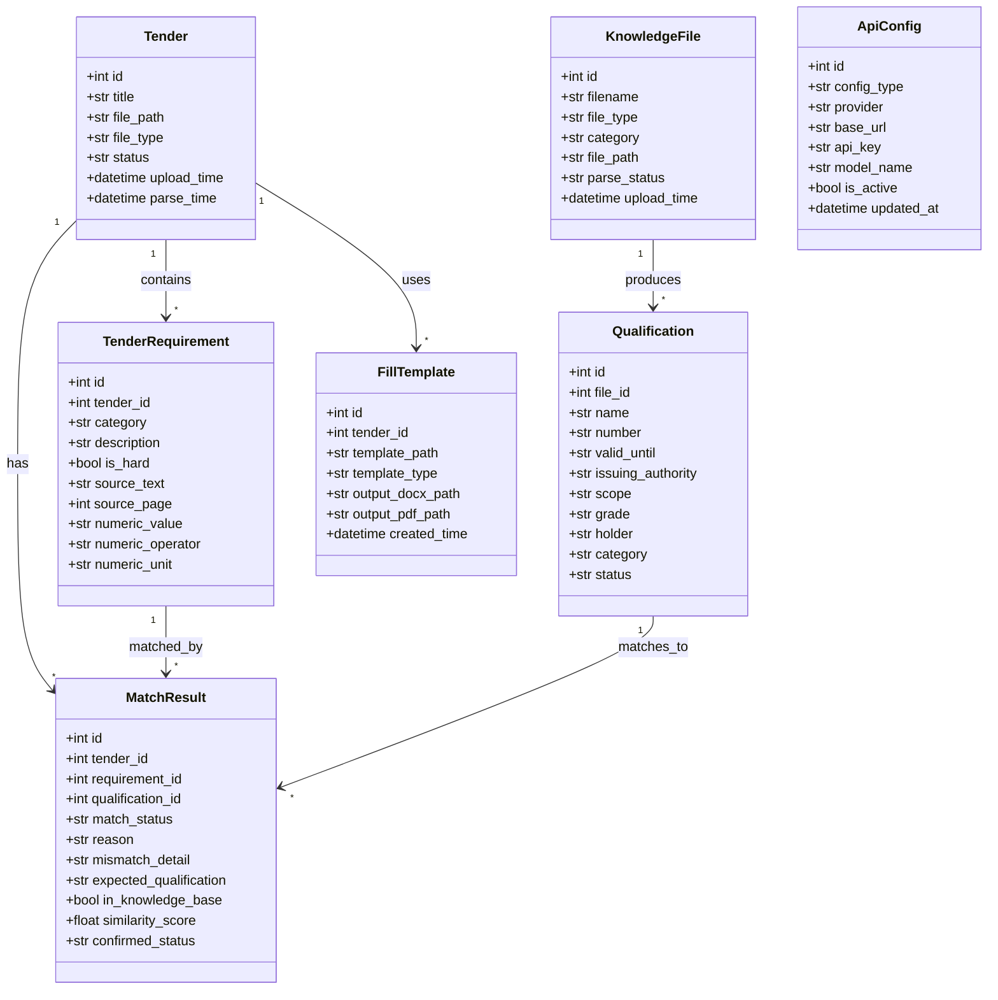
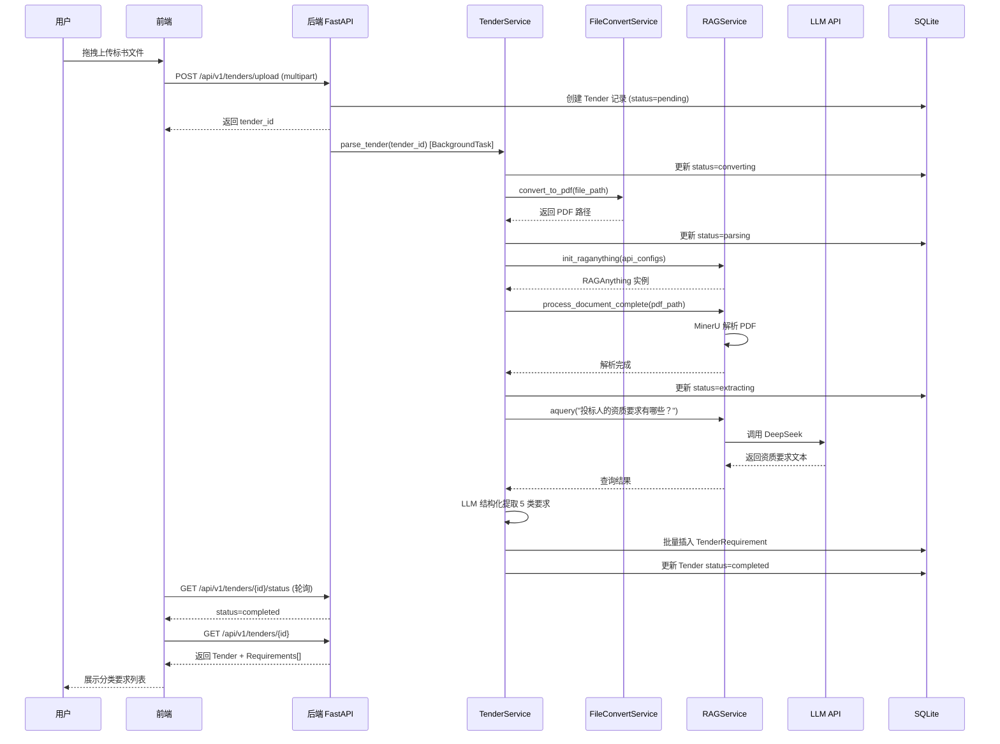
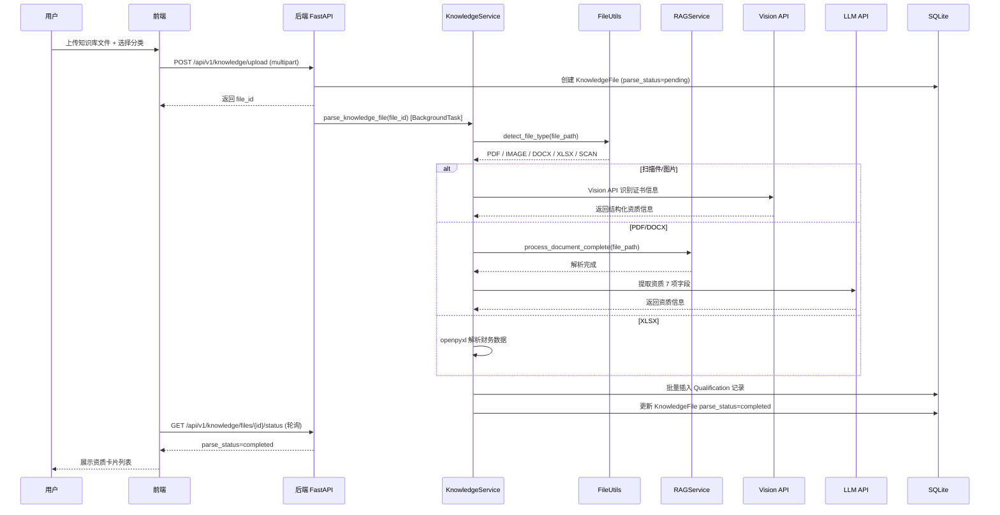
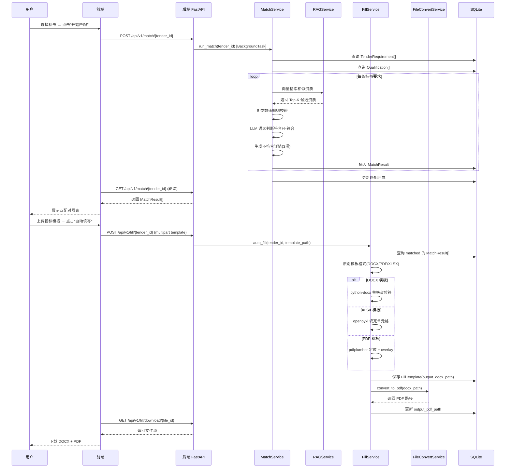
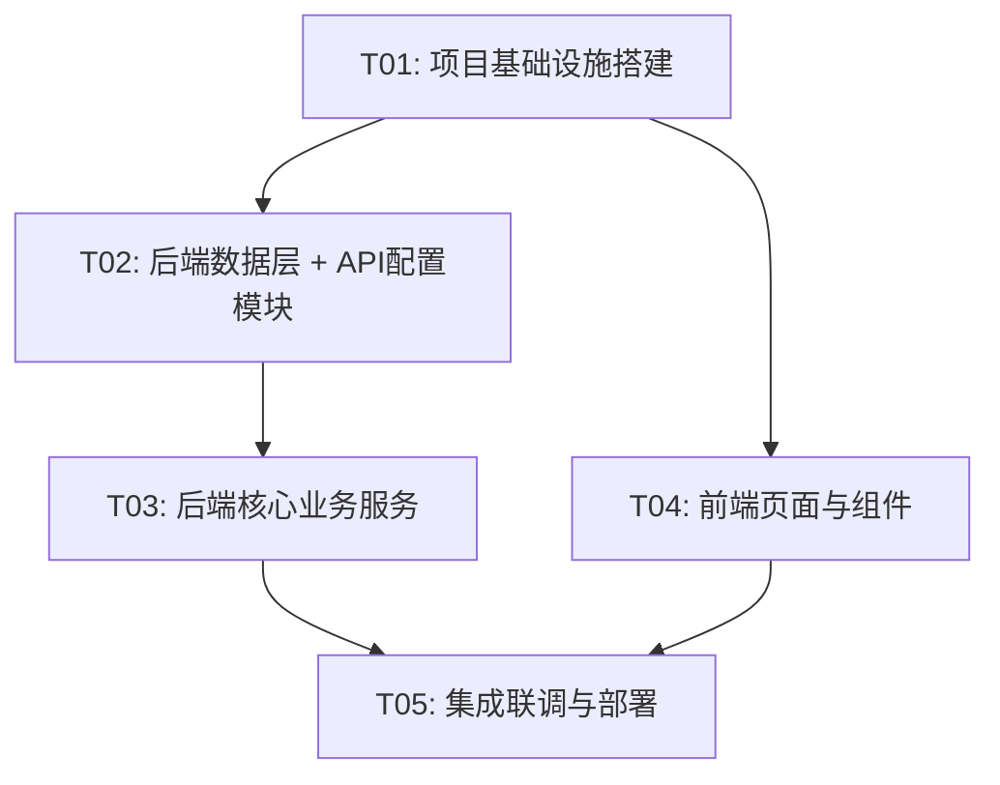

# RAG-Tender Assistant 系统架构设计文档

| 项目信息 | |
|:---|:---|
| **项目名称** | RAG-Tender Assistant 标书自动分析辅助系统 |
| **文档版本** | v1.0 |
| **基于** | PRD v1.1 |
| **架构师** | 高见远 |
| **日期** | 2025-06-22 |

---

## 1. 实现方案与框架选型

### 1.1 核心技术挑战

| 挑战 | 说明 | 应对方案 |
|:---|:---|:---|
| 多格式文档解析 | 标书/知识库文件可能是 PDF/DOCX/图片/扫描件/XLSX | RAG-Anything + MinerU 统一解析入口；LibreOffice 做 Office→PDF 预转换；paddleocr 处理扫描件 |
| API 配置运行时切换 | 用户要求三组 API（LLM/Embedding/Vision）在前端弹窗配置，不写 config.yaml | SQLite 持久化 + 运行时动态构建 RAGAnything 实例；Key 脱敏存储与显示 |
| 资质匹配准确率 ≥90% | 语义匹配 + 数值规则校验双重引擎 | 向量检索（BGE-M3）做语义相似度 + 5 类数值规则引擎做精确校验 |
| 自动填写多格式模板 | DOCX/PDF/XLSX 三种模板格式 | python-docx 填 DOCX；openpyxl 填 XLSX；pdfplumber 定位 + overlay 填 PDF；LibreOffice 转 PDF 输出 |
| 长时解析任务 | 100页标书解析 ≤3min | FastAPI BackgroundTask 异步处理 + 前端轮询/SSE 进度更新 |

### 1.2 框架选型

| 层次 | 选型 | 理由 | 替代方案（不采用原因） |
|:---|:---|:---|:---|
| 前端框架 | React 18 + Vite | 生态成熟、Vite 构建快、PRD 指定 | Vue 3（团队 React 熟悉度更高） |
| UI 组件库 | MUI 5 | 组件丰富、主题定制强、与 React 深度集成 | Ant Design（体积偏大） |
| CSS 方案 | Tailwind CSS 3 | 原子化 CSS、快速布局、与 MUI 共存 | styled-components（Tailwind 更快） |
| 后端框架 | FastAPI + uvicorn | 异步原生、自动 OpenAPI 文档、Python 生态 | Flask（异步支持弱） |
| 数据库 | SQLite（aiosqlite） | 本地单机零配置、PRD 指定 | PostgreSQL（过重，用户明确不需要） |
| 文档解析 | RAG-Anything 1.3.1 + MinerU | 已验证可用、多模态解析能力强 | Docling（功能不如 MinerU 全面） |
| 文件转换 | LibreOffice 26.2 headless | 已安装、Office→PDF 稳定 | unoconv（底层也是 LibreOffice） |
| 文档生成 | python-docx + openpyxl + pdfplumber | 分别处理 DOCX/XLSX/PDF 三种模板 | reportlab（无法编辑现有 PDF） |
| 向量检索 | LightRAG（RAG-Anything 内置） | 与 RAG-Anything 深度集成 | ChromaDB（需额外维护向量库） |

### 1.3 架构模式

采用 **前后端分离 + 服务层架构**：

```
┌─────────────────────────────────────────────────┐
│              前端 React SPA                       │
│  Pages → Components → API Layer → Axios          │
└──────────────────┬──────────────────────────────┘
                   │ HTTP REST (/api/v1/*)
┌──────────────────▼──────────────────────────────┐
│              FastAPI 后端                          │
│  Router → Service → RAG-Anything / Utils         │
│                              │                    │
│  ┌──────────┐  ┌──────────┐  ┌──────────────┐   │
│  │ Config   │  │ Tender   │  │ Knowledge    │   │
│  │ Service  │  │ Service  │  │ Service      │   │
│  ├──────────┤  ├──────────┤  ├──────────────┤   │
│  │ Match    │  │ Fill     │  │ File Convert │   │
│  │ Service  │  │ Service  │  │ Service      │   │
│  └──────────┘  └──────────┘  └──────────────┘   │
│         │            │              │             │
│  ┌──────▼──────────────▼──────────────▼──────┐  │
│  │          RAG-Anything + MinerU             │  │
│  └───────────────────┬───────────────────────┘  │
│                      │                           │
│  ┌───────────────────▼───────────────────────┐  │
│  │     SQLite (tender_assistant.db)           │  │
│  └───────────────────────────────────────────┘  │
└──────────────────────────────────────────────────┘
         │                          │
    ┌────▼────┐              ┌──────▼──────┐
    │ DeepSeek │              │ 硅基流动     │
    │ LLM API  │              │ Emb+Vision  │
    └─────────┘              └─────────────┘
```

---

## 2. 完整文件列表

```
rag-tender-assistant/
├── backend/
│   ├── requirements.txt                      # Python 依赖（~15 行）
│   ├── run.py                                # uvicorn 启动入口（~20 行）
│   └── app/
│       ├── __init__.py                       # 包标记
│       ├── main.py                           # FastAPI 应用入口、CORS、路由注册、启动事件（~80 行）
│       ├── config.py                         # 全局配置：路径、常量、供应商预设（~60 行）
│       ├── database.py                       # SQLite 初始化、表创建、连接池（~100 行）
│       ├── models/
│       │   ├── __init__.py                   # 导出所有模型
│       │   ├── tender.py                     # Tender, TenderRequirement（~80 行）
│       │   ├── knowledge.py                  # KnowledgeFile, Qualification（~90 行）
│       │   ├── match.py                      # MatchResult（~70 行）
│       │   ├── config_model.py               # ApiConfig（~40 行）
│       │   └── template.py                   # FillTemplate（~40 行）
│       ├── schemas/
│       │   ├── __init__.py                   # 导出所有 schema
│       │   ├── common.py                     # ApiResponse 统一响应（~30 行）
│       │   ├── tender.py                     # 标书相关 Pydantic schema（~80 行）
│       │   ├── knowledge.py                  # 知识库相关 schema（~80 行）
│       │   ├── match.py                      # 匹配相关 schema（~70 行）
│       │   └── config_schema.py              # API 配置 schema（~50 行）
│       ├── api/
│       │   ├── __init__.py                   # 路由聚合
│       │   ├── tenders.py                    # 标书上传/解析/查询路由（~120 行）
│       │   ├── knowledge.py                  # 知识库文件/资质管理路由（~140 行）
│       │   ├── match.py                      # 匹配执行/查询/确认路由（~80 行）
│       │   ├── fill.py                       # 自动填写路由（~80 行）
│       │   └── config_api.py                 # API 配置 CRUD + 测试连接路由（~90 行）
│       ├── services/
│       │   ├── __init__.py
│       │   ├── rag_service.py                # RAG-Anything 封装：初始化、解析、查询（~150 行）
│       │   ├── tender_service.py             # 标书解析业务逻辑（~120 行）
│       │   ├── knowledge_service.py          # 知识库解析业务逻辑（~130 行）
│       │   ├── match_service.py              # 匹配引擎：向量检索 + 规则校验（~160 行）
│       │   ├── fill_service.py               # 自动填写：多格式模板处理（~150 行）
│       │   ├── config_service.py             # API 配置 CRUD + 测试连接（~100 行）
│       │   └── file_convert.py              # LibreOffice 文件转换封装（~60 行）
│       └── utils/
│           ├── __init__.py
│           ├── llm_helpers.py               # LLM/Embedding/Vision 函数工厂（~120 行）
│           ├── file_utils.py                # 文件类型识别、路径管理、安全校验（~80 行）
│           └── mask.py                      # API Key 脱敏工具（~30 行）
├── frontend/
│   ├── package.json                          # 依赖声明
│   ├── vite.config.ts                        # Vite 配置 + 代理（~30 行）
│   ├── tsconfig.json                         # TypeScript 配置
│   ├── tailwind.config.ts                    # Tailwind 配置（淡紫色主题）（~40 行）
│   ├── postcss.config.js                     # PostCSS 配置
│   ├── index.html                            # HTML 入口
│   └── src/
│       ├── main.tsx                          # React 入口（~20 行）
│       ├── App.tsx                           # 根组件 + 路由 + 布局（~60 行）
│       ├── theme.ts                          # MUI 主题（淡紫色 #7C4DFF）（~50 行）
│       ├── index.css                         # 全局样式 + Tailwind 指令（~30 行）
│       ├── types/
│       │   └── index.ts                      # 全局 TypeScript 类型定义（~120 行）
│       ├── api/
│       │   ├── client.ts                     # Axios 实例 + 拦截器（~40 行）
│       │   ├── tenders.ts                    # 标书 API 封装（~50 行）
│       │   ├── knowledge.ts                  # 知识库 API 封装（~60 行）
│       │   ├── match.ts                      # 匹配 API 封装（~40 行）
│       │   ├── fill.ts                       # 填写 API 封装（~40 行）
│       │   └── config.ts                     # 配置 API 封装（~40 行）
│       ├── hooks/
│       │   └── useApi.ts                     # 通用 API 调用 hook（loading/error）（~60 行）
│       ├── pages/
│       │   ├── DashboardPage.tsx             # 首页/Dashboard（~100 行）
│       │   ├── TenderPage.tsx                # 标书解析页（~200 行）
│       │   ├── KnowledgePage.tsx             # 知识库页（~220 行）
│       │   ├── MatchPage.tsx                 # 匹配结果页（~180 行）
│       │   └── SettingsPage.tsx              # 设置页（~60 行）
│       └── components/
│           ├── Layout.tsx                    # 左侧导航+顶部栏+底部状态栏（~120 行）
│           ├── ApiConfigDialog.tsx           # API 配置弹窗 P0-10（~250 行）
│           ├── FileUpload.tsx                # 拖拽上传组件（~100 行）
│           ├── TenderRequirementList.tsx     # 标书要求列表+分类Tab（~120 行）
│           ├── QualificationCard.tsx         # 资质信息卡片（~80 行）
│           ├── MatchTable.tsx                # 匹配结果对照表（~150 行）
│           └── ProgressIndicator.tsx         # 解析进度指示器（~60 行）
├── data/                                     # 运行时数据（gitignore）
│   ├── uploads/
│   │   ├── tenders/                          # 标书上传文件
│   │   ├── knowledge/                        # 知识库上传文件
│   │   └── templates/                        # 投标模板文件
│   ├── output/                               # 填写结果输出
│   ├── rag_workspace/                        # RAG-Anything 工作目录
│   └── tender_assistant.db                   # SQLite 数据库文件
├── docs/
│   └── ARCHITECTURE.md                       # 本文档
├── start.bat                                 # Windows 一键启动脚本
└── README.md                                 # 项目说明
```

---

## 3. 数据结构与接口（类图）



### 关键字段说明

| 模型 | 关键字段 | 说明 |
|:---|:---|:---|
| TenderRequirement | `category` | 枚举：qualification/performance/financial/personnel/other |
| TenderRequirement | `numeric_value/operator/unit` | 数值规则：如 "1000", ">=", "万元"，用于规则校验 |
| Qualification | `status` | 枚举：valid/expiring/expired，由 valid_until 计算 |
| MatchResult | `match_status` | 枚举：matched/unmatched/needs_review |
| MatchResult | `mismatch_detail` | 不符合的具体点（P0-07 要求①） |
| MatchResult | `expected_qualification` | 期望资质描述（P0-07 要求②） |
| MatchResult | `in_knowledge_base` | 知识库是否已有该资质（P0-07 要求③） |
| ApiConfig | `config_type` | 枚举：llm/embedding/vision |
| ApiConfig | `api_key` | 存储时不脱敏，返回前端时脱敏（仅末4位） |

---

## 4. 程序调用流程（时序图）

### 4.1 标书解析流程



### 4.2 知识库解析流程



### 4.3 匹配 + 填写流程



---

## 5. 任务列表

> 严格遵循：≤5 个任务，每个 ≥3 文件，按模块分组，T01 为项目基础设施。

### T01: 项目基础设施搭建

| 属性 | 值 |
|:---|:---|
| **任务ID** | T01 |
| **任务名** | 项目基础设施搭建 |
| **模块** | 全局 |
| **依赖** | 无 |
| **优先级** | P0 |
| **工作量** | M (1-4h) |

**源文件**：
```
backend/requirements.txt
backend/run.py
backend/app/__init__.py
backend/app/main.py
backend/app/config.py
backend/app/database.py
frontend/package.json
frontend/vite.config.ts
frontend/tsconfig.json
frontend/tailwind.config.ts
frontend/postcss.config.js
frontend/index.html
frontend/src/main.tsx
frontend/src/App.tsx
frontend/src/theme.ts
frontend/src/index.css
start.bat
data/.gitkeep
```

**描述**：
- 创建完整目录结构（backend/frontend/data）
- `requirements.txt`：列出所有 Python 依赖（见第 6 节）
- `main.py`：FastAPI 应用实例 + CORS + 路由注册占位 + `/api/v1/health` 健康检查
- `config.py`：全局常量（路径、供应商预设列表、颜色常量）
- `database.py`：SQLite 连接初始化 + 所有表 DDL 建表
- `run.py`：uvicorn 启动入口，端口 8000
- `package.json`：前端依赖（见第 6 节）
- `vite.config.ts`：Vite 配置 + `/api` 代理到 `localhost:8000`
- `tailwind.config.ts`：淡紫色主题色配置
- `theme.ts`：MUI createTheme，primary=#7C4DFF，配 PRD 配色规范
- `App.tsx`：根组件 + React Router 路由骨架（5 个页面占位）
- `start.bat`：同时启动前后端的 Windows 脚本

---

### T02: 后端数据层 + API 配置模块

| 属性 | 值 |
|:---|:---|
| **任务ID** | T02 |
| **任务名** | 后端数据层 + API 配置模块 |
| **模块** | backend/models, backend/schemas, backend/services/config, backend/api/config, backend/utils |
| **依赖** | T01 |
| **优先级** | P0 |
| **工作量** | L (4-8h) |

**源文件**：
```
backend/app/models/__init__.py
backend/app/models/tender.py
backend/app/models/knowledge.py
backend/app/models/match.py
backend/app/models/config_model.py
backend/app/models/template.py
backend/app/schemas/__init__.py
backend/app/schemas/common.py
backend/app/schemas/config_schema.py
backend/app/schemas/tender.py
backend/app/schemas/knowledge.py
backend/app/schemas/match.py
backend/app/services/config_service.py
backend/app/api/config_api.py
backend/app/utils/__init__.py
backend/app/utils/mask.py
backend/app/utils/llm_helpers.py
backend/app/utils/file_utils.py
```

**描述**：
- `models/`：定义全部 7 个数据模型类（见第 3 节类图），使用 dataclass 或 Pydantic BaseModel，字段与 SQLite 表一一对应
- `schemas/`：Pydantic 请求/响应 schema
  - `common.py`：`ApiResponse[T]` 统一响应格式 `{code, data, message}`
  - `config_schema.py`：`ApiConfigCreate`, `ApiConfigResponse`(api_key 脱敏), `TestConnectionRequest`
  - `tender.py`：`TenderUploadResponse`, `TenderDetail`, `TenderRequirementUpdate`
  - `knowledge.py`：`KnowledgeFileResponse`, `QualificationCreate`, `QualificationUpdate`
  - `match.py`：`MatchResultResponse`, `MatchConfirmRequest`
- `config_service.py`：
  - `get_all_configs()` → 从 SQLite 读取三组配置
  - `save_config(config_type, data)` → 保存配置（is_active=true，其余同类置 false）
  - `test_connection(config_type, base_url, api_key, model)` → 发送测试请求返回 `{success, latency_ms}`
- `config_api.py`：`GET /api/v1/config`、`POST /api/v1/config`、`POST /api/v1/config/test`
- `mask.py`：`mask_key(key)` → `****` + 末4位；`mask_in_log(key)` → 日志中完全不输出
- `llm_helpers.py`：`build_llm_func(api_config)`, `build_embedding_func(api_config)`, `build_vision_func(api_config)` → 工厂函数，从 DB 配置动态构建 RAG-Anything 所需的异步函数
- `file_utils.py`：`detect_file_type(path)` → filetype 库识别；`safe_save_path(filename, category)` → 生成安全存储路径

**验收标准**：
- `POST /api/v1/config` 能保存三组 API 配置到 SQLite
- `POST /api/v1/config/test` 能测试连接并返回延迟
- `GET /api/v1/config` 返回的 api_key 已脱敏
- 所有日志中不出现明文 API Key

---

### T03: 后端核心业务服务

| 属性 | 值 |
|:---|:---|
| **任务ID** | T03 |
| **任务名** | 后端核心业务服务（解析 + 匹配 + 填写） |
| **模块** | backend/services, backend/api |
| **依赖** | T02 |
| **优先级** | P0 |
| **工作量** | XL (1-2天) |

**源文件**：
```
backend/app/services/rag_service.py
backend/app/services/tender_service.py
backend/app/services/knowledge_service.py
backend/app/services/match_service.py
backend/app/services/fill_service.py
backend/app/services/file_convert.py
backend/app/api/tenders.py
backend/app/api/knowledge.py
backend/app/api/match.py
backend/app/api/fill.py
```

**描述**：

**rag_service.py** — RAG-Anything 封装层：
- `get_rag_instance()` → 从 DB 读取活跃 API 配置，调用 `llm_helpers` 构建函数，初始化 RAGAnything 实例（单例缓存，配置变更时重建）
- `parse_document(file_path)` → 调用 `rag.process_document_complete()`
- `query(question, mode="hybrid")` → 调用 `rag.aquery()`

**tender_service.py** — 标书解析（P0-01, P0-02）：
- `upload_tender(file)` → 保存文件、创建 Tender 记录
- `parse_tender(tender_id)` → 异步：LibreOffice 转 PDF → RAG 解析 → LLM 提取 5 类要求 → 结构化存储
- `get_tender_detail(tender_id)` → 返回标书 + 要求列表
- `update_requirement(req_id, data)` → 编辑标书要求（P1-01）

**knowledge_service.py** — 知识库解析（P0-04, P0-05, P0-06）：
- `upload_file(file, category)` → 保存文件、创建 KnowledgeFile
- `parse_knowledge_file(file_id)` → 异步：格式识别 → OCR(如需) → RAG/Vision 解析 → LLM 提取 7 项资质字段 → 存储
- `get_qualifications(category, keyword)` → 列表查询（P1-06 筛选搜索）
- `update_qualification(id, data)` / `create_qualification(data)` / `delete_qualification(id)`

**match_service.py** — 匹配引擎（P0-07, P0-08）：
- `run_match(tender_id)` → 异步：加载标书要求 + 知识库资质 → 逐条匹配
- 匹配逻辑：
  1. 向量检索：用 BGE-M3 对要求描述做 embedding，检索 Top-K 候选资质
  2. 规则校验：5 类数值规则（注册资本/合同金额/营业收入/资产负债率/人员年限）
  3. LLM 判断：对模糊要求调用 LLM 做语义判断
  4. 不符合项生成 3 项详情：具体不符合点 + 期望资质 + 知识库检查建议
- `get_match_results(tender_id)` → 返回匹配结果列表
- `confirm_match(result_id, status)` → 人工确认（P1-02）

**fill_service.py** — 自动填写（P0-09）：
- `auto_fill(tender_id, template_file)` → 异步：
  1. 识别模板格式（DOCX/PDF/XLSX）
  2. 查询 matched 的 MatchResult 获取资质信息
  3. 根据格式调用对应填充器：
     - DOCX：python-docx 查找占位符 `{{字段名}}` 替换
     - XLSX：openpyxl 定位单元格填充
     - PDF：pdfplumber 定位文本位置 + reportlab overlay
  4. 不符合的字段标注 `[待填写]`
  5. LibreOffice 转 PDF 输出
  6. 保存 FillTemplate 记录
- `download_result(template_id, format)` → 返回文件流

**file_convert.py** — LibreOffice 封装：
- `convert_to_pdf(input_path, output_dir)` → 调用 `soffice.exe --headless --convert-to pdf`
- `is_libreoffice_available()` → 检查 PATH 中是否有 soffice

**API 路由**（与前端页面一一对应）：
- `tenders.py`：`POST /upload`, `GET /`, `GET /{id}`, `PUT /{id}/requirements/{rid}`, `POST /{id}/reparse`, `GET /{id}/status`
- `knowledge.py`：`POST /upload`, `GET /files`, `GET /qualifications`, `GET/PUT/POST/DELETE /qualifications`, `GET /files/{id}/status`
- `match.py`：`POST /{tender_id}`, `GET /{tender_id}`, `PUT /{result_id}/confirm`
- `fill.py`：`POST /{tender_id}`, `GET /download/{file_id}`, `POST /templates`, `GET /templates`

---

### T04: 前端页面与组件

| 属性 | 值 |
|:---|:---|
| **任务ID** | T04 |
| **任务名** | 前端页面与组件开发 |
| **模块** | frontend/src/pages, frontend/src/components, frontend/src/api, frontend/src/types |
| **依赖** | T01 |
| **优先级** | P0 |
| **工作量** | XL (1-2天) |

**源文件**：
```
frontend/src/types/index.ts
frontend/src/api/client.ts
frontend/src/api/tenders.ts
frontend/src/api/knowledge.ts
frontend/src/api/match.ts
frontend/src/api/fill.ts
frontend/src/api/config.ts
frontend/src/hooks/useApi.ts
frontend/src/pages/DashboardPage.tsx
frontend/src/pages/TenderPage.tsx
frontend/src/pages/KnowledgePage.tsx
frontend/src/pages/MatchPage.tsx
frontend/src/pages/SettingsPage.tsx
frontend/src/components/Layout.tsx
frontend/src/components/ApiConfigDialog.tsx
frontend/src/components/FileUpload.tsx
frontend/src/components/TenderRequirementList.tsx
frontend/src/components/QualificationCard.tsx
frontend/src/components/MatchTable.tsx
frontend/src/components/ProgressIndicator.tsx
```

**描述**：

**types/index.ts**：定义所有 TypeScript 接口（与后端 schema 对应）：Tender, TenderRequirement, KnowledgeFile, Qualification, MatchResult, ApiConfig, FillTemplate, ApiResponse<T>

**api/ 层**：Axios 实例（baseURL=/api/v1）+ 各模块 API 封装函数。`client.ts` 含响应拦截器统一处理 `{code, data, message}` 格式。

**Layout.tsx**（P0-11 布局）：
- 左侧导航栏（~200px）：标书解析 / 知识库 / 匹配结果 / 设置
- 顶部栏：Logo + 标题 + ⚙ API配置按钮 + 用户头像
- 底部状态栏：API 状态指示灯 + 解析队列数 + 知识库统计
- 配色：导航选中态 #7C4DFF，背景白色，卡片 #F9F7FF

**ApiConfigDialog.tsx**（P0-10，最优先组件）：
- 三组独立配置卡片（LLM/Embedding/Vision）
- 每组：供应商下拉预设（DeepSeek/硅基流动/智谱/自定义）→ 自动填充 Base URL + Model
- API Key 密码框 + 👁 切换显示 + 脱敏（仅末4位）
- "测试连接"按钮 → 调 `/api/v1/config/test` → 显示成功/失败 + 延迟
- "保存配置"按钮 → 调 `/api/v1/config`
- 弹窗打开时自动加载已保存配置

**DashboardPage.tsx**：首页概览（资质总数、即将过期数、最近标书、匹配概要）

**TenderPage.tsx**（P0-01, P0-02, P0-03）：
- 上传区：FileUpload 组件（拖拽 + 点击）
- 历史解析列表
- 解析完成视图：TenderRequirementList（5 类分类 Tab + 展开折叠 + 查看原文）
- ProgressIndicator 显示解析阶段（上传→转换→OCR→提取→入库）

**KnowledgePage.tsx**（P0-04, P0-05, P0-06）：
- 左侧：分类树（全部/企业资质/人员资质/业绩/财务）+ 搜索框
- 右侧上半：QualificationCard 列表（7 项字段 + 状态徽章 + 有效期提醒 P1-05）
- 右侧下半：文件缩略图列表
- 上传弹窗：选分类 → 拖拽文件 → 自动解析

**MatchPage.tsx**（P0-07, P0-08, P0-09）：
- 顶部概要栏：符合/不符合/需确认数量
- MatchTable：双栏对照表（标书要求 | 匹配资质 | 状态）
  - 绿行=符合，红行=不符合，橙行=需确认
  - 不符合项可展开：具体不符合点 + 期望资质 + 知识库检查状态
- "自动填写"按钮 → 弹出模板上传 → 提交填写 → 下载 DOCX/PDF

**SettingsPage.tsx**：设置页占位（API 配置通过弹窗触发，此页可放版本信息等）

---

### T05: 集成联调与部署

| 属性 | 值 |
|:---|:---|
| **任务ID** | T05 |
| **任务名** | 集成联调与部署 |
| **模块** | 全局 |
| **依赖** | T03, T04 |
| **优先级** | P0 |
| **工作量** | M (1-4h) |

**源文件**：
```
start.bat (完善)
README.md
backend/app/api/__init__.py (路由聚合注册)
backend/app/main.py (完善路由注册)
frontend/src/App.tsx (完善路由配置)
```

**描述**：
- 在 `main.py` 中注册所有路由 router（tenders, knowledge, match, fill, config）
- 在 `App.tsx` 中配置完整路由（/ → Dashboard, /tenders → TenderPage, /knowledge → KnowledgePage, /match/:id → MatchPage, /settings → SettingsPage）
- `start.bat`：启动后端（`python backend/run.py`）+ 启动前端（`cd frontend && npm run dev`）+ 等待 3 秒后打开浏览器 `http://localhost:5173`
- 前后端联调：确认所有 API 端点可达、文件上传正常、解析流程完整、匹配结果展示正确、自动填写下载正常
- `README.md`：安装步骤、启动方式、API 配置说明、已知限制

---

## 6. 依赖包列表

### 6.1 backend/requirements.txt

```txt
# Web 框架
fastapi==0.115.0
uvicorn==0.49.0
python-multipart==0.0.32

# 数据验证
pydantic==2.9.0

# 数据库
aiosqlite==0.20.0

# HTTP 客户端（API 测试连接）
httpx==0.27.0

# RAG 核心（已安装，列出固定版本）
raganything==1.3.1
lightrag-hku==1.5.3
mineru==3.4.0
paddleocr==3.7.0
paddlepaddle==3.3.1

# 文档处理
python-docx==1.1.2
openpyxl==3.1.5
pdfplumber==0.11.10
filetype==1.2.0

# PyTorch（CPU 版，已安装）
torch==2.12.1

# 工具
pyyaml==6.0.2
```

### 6.2 frontend/package.json dependencies

```json
{
  "dependencies": {
    "react": "^18.2.0",
    "react-dom": "^18.2.0",
    "react-router-dom": "^6.20.0",
    "@mui/material": "^5.14.0",
    "@mui/icons-material": "^5.14.0",
    "@emotion/react": "^11.11.0",
    "@emotion/styled": "^11.11.0",
    "axios": "^1.6.0"
  },
  "devDependencies": {
    "@types/react": "^18.2.0",
    "@types/react-dom": "^18.2.0",
    "@vitejs/plugin-react": "^4.2.0",
    "typescript": "^5.3.0",
    "vite": "^5.0.0",
    "tailwindcss": "^3.4.0",
    "postcss": "^8.4.0",
    "autoprefixer": "^10.4.0"
  }
}
```

---

## 7. 共享知识（跨文件约定）

### 7.1 API 响应格式

所有 API 统一返回：

```json
{
  "code": 0,
  "data": {},
  "message": "success"
}
```

### 7.2 错误码定义

| 错误码 | 含义 | HTTP Status |
|:---:|:---|:---:|
| 0 | 成功 | 200 |
| 1001 | 参数校验失败 | 400 |
| 1002 | 文件格式不支持 | 400 |
| 1003 | 文件大小超限（>100MB） | 400 |
| 2001 | API 配置未找到 | 404 |
| 2002 | API 连接失败 | 502 |
| 2003 | API Key 无效 | 401 |
| 3001 | 标书解析失败 | 500 |
| 3002 | 知识库解析失败 | 500 |
| 3003 | 匹配执行失败 | 500 |
| 4001 | 自动填写失败 | 500 |
| 4002 | LibreOffice 转换失败 | 500 |
| 5001 | 内部服务器错误 | 500 |

### 7.3 文件存储路径约定

```
data/
├── uploads/
│   ├── tenders/          # {timestamp}_{filename}.pdf
│   ├── knowledge/        # {category}/{timestamp}_{filename}
│   └── templates/        # {tender_id}_{timestamp}_{filename}
├── output/               # {tender_id}_filled_{timestamp}.docx / .pdf
├── rag_workspace/        # RAG-Anything 内部存储（向量库/知识图谱）
└── tender_assistant.db   # SQLite 数据库
```

### 7.4 SQLite 表结构约定

- 所有表主键为 `id INTEGER PRIMARY KEY AUTOINCREMENT`
- 时间字段统一 `TEXT` 类型，ISO 8601 格式（`YYYY-MM-DD HH:MM:SS`）
- `api_configs` 表的 `api_key` 字段加密存储（`enc:...`），所有 API 返回和日志输出必须脱敏
- 外键约束启用：`PRAGMA foreign_keys = ON`
- 数据库初始化在 `database.py` 中一次性执行 DDL

### 7.5 前后端接口契约

- 所有 API 前缀：`/api/v1/`
- 文件上传：`multipart/form-data`，字段名 `file`
- 文件下载：`Response` 流，`Content-Disposition: attachment`
- 长时任务（解析/匹配/填写）：POST 返回 `{tender_id}` 或 `{file_id}`，前端轮询 `GET /{id}/status` 获取进度
- 前端开发端口 5173，后端 API 端口 8000，Vite 代理 `/api` → `localhost:8000`
- 生产部署：前端 `npm run build` → `dist/`，后端 FastAPI 静态文件托管 `dist/`

### 7.6 API Key 安全约定

- **存储**：SQLite 存储密文，主密钥来自环境变量 `RAG_TENDER_SECRET_KEY`
- **API 返回**：`api_key` 字段返回 `****` + 末 4 位（如 `****abcd`）
- **日志**：所有日志中 API Key 替换为 `[REDACTED]`，不输出任何明文片段
- **前端显示**：默认密码框隐藏；已保存 Key 只显示脱敏值，编辑时输入新 Key 覆盖
- **迁移**：启动时自动将旧数据库中的明文 Key 迁移为密文；主密钥丢失后旧 Key 无法恢复

### 7.7 RAG-Anything 实例管理

- RAGAnything 实例**单例缓存**，在 `rag_service.py` 中管理
- API 配置变更时（`POST /api/v1/config` 保存后）**自动重建实例**
- 实例重建失败时保留旧实例 + 返回警告
- 每个标书/知识库文件解析使用**独立工作目录**（`data/rag_workspace/{tender_id}/`），避免向量库污染

---

## 8. 任务依赖图



**关键路径**：T01 → T02 → T03 → T05（后端主线）
**并行路径**：T01 → T04（前端可与 T02/T03 并行开发）

---

## 9. 待明确事项

| # | 问题 | 当前假设 | 需确认方 |
|:---:|:---|:---|:---|
| 1 | 标书原文定位：P0-03 要求"查看原文"跳转到标书对应位置，实现方式？ | 假设用 pdfplumber 提取文本 + 页码，前端用 iframe 内嵌 PDF 并滚动到对应页 | 用户/前端工程师 |
| 2 | 模板占位符格式：python-docx 填写时用什么占位符语法？ | 假设 `{{证书编号}}`、`{{有效期}}` 等 Mustache 风格，用户上传的模板需预先标注占位符 | 用户 |
| 3 | Vision API 兼容性：Nex-N2-Pro 的 image_url 格式是否完全兼容 OpenAI 格式？ | Phase 2 验证脚本已实现 OpenAI 兼容调用，假设可用；不可用时切换 GLM-4V | 已在 config.yaml 留 fallback_model |
| 4 | RAG-Anything 实例重建时机：API 配置变更后，正在进行的解析任务如何处理？ | 假设：进行中的任务用旧配置完成，新任务用新配置；前端提示"配置已更新，新任务将使用新配置" | 架构师决策 |
| 5 | 多标书/多知识库文件的向量库隔离：是否每个标书独立 RAG 工作目录？ | 假设是：每标书 `data/rag_workspace/{tender_id}/`，知识库共享一个 `data/rag_workspace/knowledge/` | 架构师决策 |

---

> **文档结束**。如有架构层面疑问，请联系架构师高见远。工程师寇豆码请按 T01→T02→T03→T05 顺序执行，T04 可与 T02/T03 并行。
