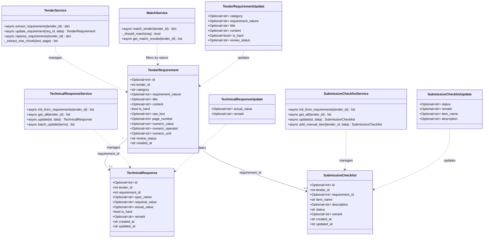
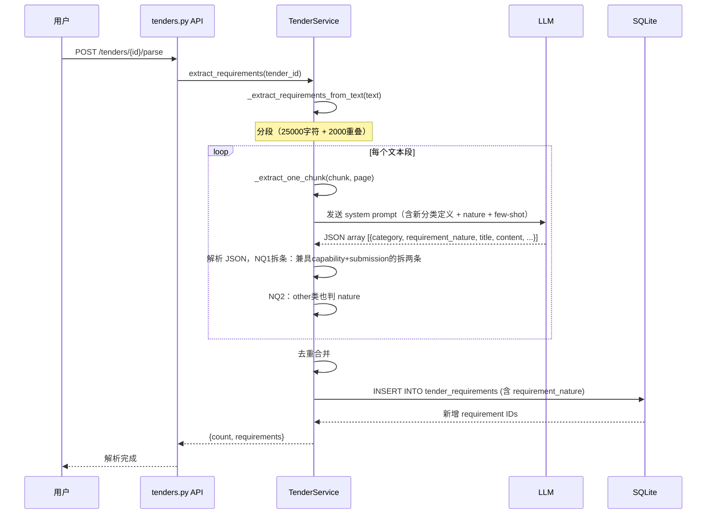
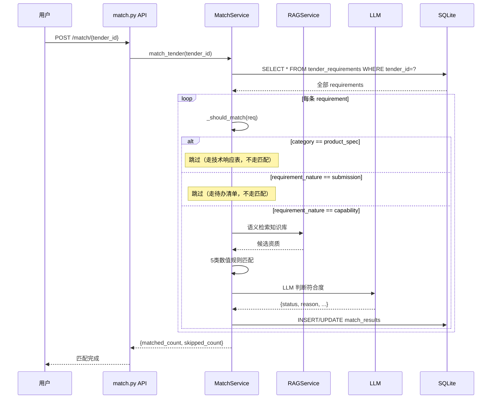
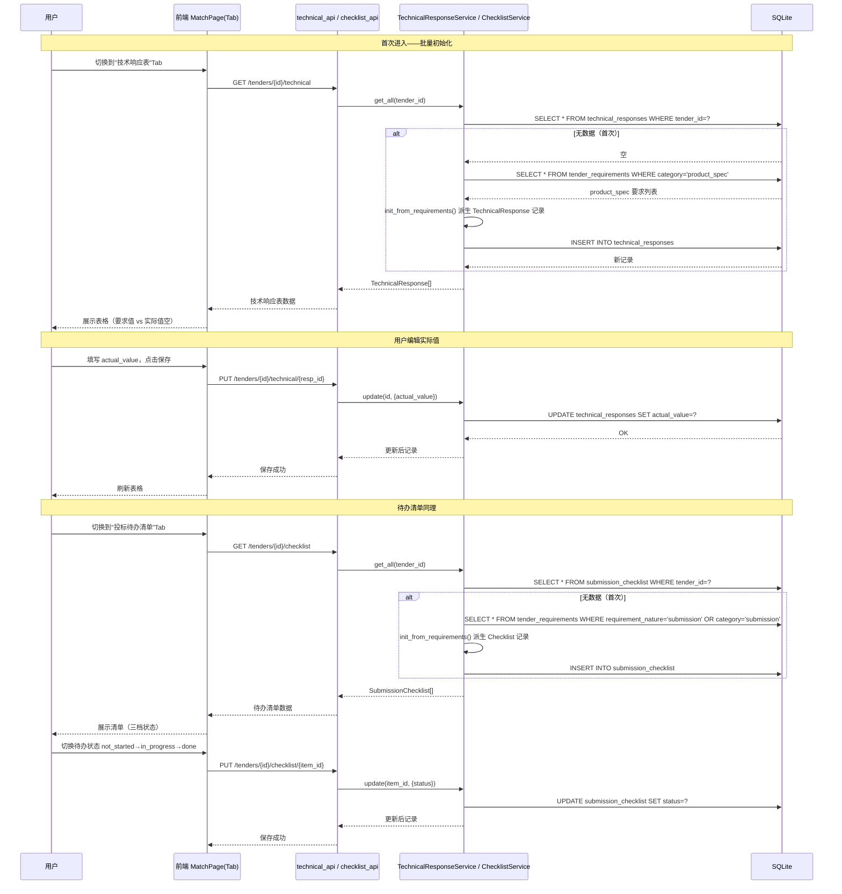

# 增量架构设计：标书要求按处理动作重新分类

> 本文档为 **增量改造设计**，仅描述本次改动范围，不重复已有架构。
> 基于已确认的 PRD 决策（Q1-Q6 + NQ1-NQ5）及主理人预读源码摘要。

---

## 1. 实现方案 + 框架选型

### 1.1 技术路线

**不换框架，纯增量改造。** 现有技术栈（FastAPI + React 18 + MUI 5 + SQLite）完全满足需求，本次改造只涉及业务逻辑层与数据层的增量修改。

### 1.2 核心技术挑战

| 挑战 | 方案 |
|------|------|
| 标书要求需按"处理动作"重新分类（新增 `product_spec` / `submission` 两类） | 扩展 `category` 枚举，重写 LLM 提取 Prompt |
| `performance/financial/personnel` 需区分 capability/submission 子维度 | 新增 `requirement_nature` 字段，LLM 自动判断 + 手动可改 |
| 一条要求兼具 capability+submission 需拆两条 | Prompt 约束 + 解析层后处理拆条 |
| 匹配流程需按 nature 分流（capability 走匹配，submission 跳过） | `match_service` 增加前置过滤逻辑 |
| 技术响应表 / 待办清单需独立存储 | 新建 `technical_responses` / `submission_checklist` 两张表 |
| 历史数据兼容 | `requirement_nature` 默认 `capability`；提供"重新解析"按钮（不写迁移脚本） |

### 1.3 改动边界

**改动（增量修改）：**
- 后端：`database.py`（迁移）、`models/tender.py`、`schemas/tender.py`、`tender_service.py`（Prompt+解析）、`match_service.py`（分流）
- 后端新增：`services/technical_response_service.py`、`services/submission_checklist_service.py`、`api/technical_api.py`、`api/checklist_api.py`、`schemas/technical.py`、`schemas/checklist.py`、`models/technical.py`、`models/checklist.py`
- 前端：`types/index.ts`、`api/tenders.ts`、`api/match.ts`、`App.tsx`（路由）、`pages/MatchPage.tsx`（Tab 改造）、`pages/TenderReviewPage.tsx`、`components/RequirementCard.tsx`、`components/MatchResultTable.tsx`、`components/RequirementReviewWorkbench.tsx`
- 前端新增：`api/technical.ts`、`api/checklist.ts`、`pages/TechnicalResponsePage.tsx`、`pages/SubmissionChecklistPage.tsx`、`components/TechnicalResponseTable.tsx`、`components/SubmissionChecklistTable.tsx`、`components/MatchResultTabs.tsx`

**不动：**
- `config.py`、`utils/*`、`rag_service.py`、`knowledge_service.py`、`fill_service.py`、`document_parser.py`、`file_convert.py`、前端 `theme.ts`、`Layout.tsx`、`Sidebar.tsx`（仅加菜单项）、`main.tsx`

---

## 2. 文件列表及相对路径

### 2.1 后端文件

| # | 文件路径 | 操作 | 改动概要 | 关联需求 |
|---|---------|------|---------|---------|
| B01 | `backend/app/database.py` | 修改 | 新增 3 条迁移 DDL：`requirement_nature` 列 + 2 张新表 | P0-R1, P0-R2, P0-R3 |
| B02 | `backend/app/models/tender.py` | 修改 | `TenderRequirement` 新增 `requirement_nature` 字段，默认 `capability` | P0-R1 |
| B03 | `backend/app/models/technical.py` | 新建 | `TechnicalResponse` Pydantic 模型 | P0-R2 |
| B04 | `backend/app/models/checklist.py` | 新建 | `SubmissionChecklist` Pydantic 模型 | P0-R3 |
| B05 | `backend/app/schemas/tender.py` | 修改 | `TenderRequirementUpdate` 新增 `requirement_nature` 字段；`TenderRequirementCreate` 同步 | P0-R1 |
| B06 | `backend/app/schemas/technical.py` | 新建 | `TechnicalResponseCreate/Update` 请求 schema | P0-R2 |
| B07 | `backend/app/schemas/checklist.py` | 新建 | `SubmissionChecklistUpdate` 请求 schema | P0-R3 |
| B08 | `backend/app/services/tender_service.py` | 修改 | 重写 `_EXTRACT_SYSTEM_PROMPT`；扩展 `REQUIREMENT_CATEGORIES`；解析层拆条逻辑；`update/create` 的 `allowed_fields` 增加 `requirement_nature` | P0-R1, P0-R4, NQ1, NQ2 |
| B09 | `backend/app/services/match_service.py` | 修改 | `match_tender()` 增加分流：`requirement_nature=capability` 才走匹配，`submission` 跳过；`product_spec` 类跳过 | P0-R4 |
| B10 | `backend/app/services/technical_response_service.py` | 新建 | 技术响应表 CRUD + 从 requirements 批量初始化 | P0-R2 |
| B11 | `backend/app/services/submission_checklist_service.py` | 新建 | 待办清单 CRUD + 从 requirements 批量初始化 + 状态更新 | P0-R3 |
| B12 | `backend/app/api/tenders.py` | 修改 | 新增"重新解析"端点（清空受影响匹配结果）；requirements CRUD 字段同步 | P0-R1, P2-R1, NQ4 |
| B13 | `backend/app/api/technical_api.py` | 新建 | `GET/PUT /tenders/{id}/technical` 端点 | P0-R2 |
| B14 | `backend/app/api/checklist_api.py` | 新建 | `GET/PUT /tenders/{id}/checklist` 端点 | P0-R3 |
| B15 | `backend/app/main.py` | 修改 | 注册 `technical_api`、`checklist_api` 路由 | P0-R2, P0-R3 |

### 2.2 前端文件

| # | 文件路径 | 操作 | 改动概要 | 关联需求 |
|---|---------|------|---------|---------|
| F01 | `frontend/src/types/index.ts` | 修改 | 新增 `product_spec`/`submission` category；新增 `requirement_nature`；新增 `TechnicalResponse`/`SubmissionChecklist` 接口 | P0-R1, P0-R2, P0-R3 |
| F02 | `frontend/src/api/tenders.ts` | 修改 | 新增 `reparseRequirements()` 调用；requirement 字段同步 | P0-R1, P2-R1 |
| F03 | `frontend/src/api/technical.ts` | 新建 | 技术响应表 API 调用 | P0-R2 |
| F04 | `frontend/src/api/checklist.ts` | 新建 | 待办清单 API 调用 | P0-R3 |
| F05 | `frontend/src/api/match.ts` | 修改 | 匹配结果获取接口不变，类型适配 | P0-R4 |
| F06 | `frontend/src/pages/MatchPage.tsx` | 修改 | 改造为 Tab 布局（企业资质匹配/技术响应表/投标待办清单） | P0-R6 |
| F07 | `frontend/src/components/MatchResultTabs.tsx` | 新建 | 三 Tab 容器组件 | P0-R6 |
| F08 | `frontend/src/components/TechnicalResponseTable.tsx` | 新建 | 技术响应表（要求 vs 实际值，用户手填） | P0-R2 |
| F09 | `frontend/src/components/SubmissionChecklistTable.tsx` | 新建 | 待办清单（三档状态切换） | P0-R3 |
| F10 | `frontend/src/components/MatchResultTable.tsx` | 修改 | 只展示 capability 类匹配结果（Tab1 内容） | P0-R4 |
| F11 | `frontend/src/pages/TenderReviewPage.tsx` | 修改 | 核对工作台显示新 category + nature 标签；手动调整 nature 下拉 | P0-R1, P0-R5 |
| F12 | `frontend/src/components/RequirementCard.tsx` | 修改 | 卡片显示新 category 标签 + nature 子标签；灰色地带备注提示 | P0-R1, P0-R5 |
| F13 | `frontend/src/components/RequirementReviewWorkbench.tsx` | 修改 | `CATEGORY_LABELS`/`CATEGORY_COLORS` 扩展 2 类；nature 下拉控件 | P0-R1 |
| F14 | `frontend/src/components/Sidebar.tsx` | 修改 | 无需新菜单（匹配页内 Tab 切换），但确认无需改动 | — |
| F15 | `frontend/src/pages/TechnicalResponsePage.tsx` | 新建 | 技术响应独立页面（可选，若用 Tab 则不需要） | P0-R2 |
| F16 | `frontend/src/pages/SubmissionChecklistPage.tsx` | 新建 | 待办清单独立页面（可选，若用 Tab 则不需要） | P0-R3 |

> **说明**：按 Q6 决策，匹配结果页用统一 Tab 切换，F15/F16 作为独立路由页面可选保留，也可以不建独立页、全部内嵌到 MatchPage Tab。本设计采用**内嵌 Tab 方案**，F15/F16 标记为不建（减少文件数）。

---

## 3. 数据结构和接口（类图）

### 3.1 数据库设计

#### 3.1.1 `tender_requirements` 表新增字段

```sql
ALTER TABLE tender_requirements ADD COLUMN requirement_nature TEXT NOT NULL DEFAULT 'capability';
```

- 旧数据自动获得 `capability` 默认值，向后兼容。
- 取值：`capability`（走匹配）/ `submission`（走待办清单）。

#### 3.1.2 `category` 枚举扩展

| 原值 | 新增值 | 说明 |
|------|--------|------|
| qualification | — | 保留，企业资质类 |
| performance | — | 保留，业绩类 |
| financial | — | 保留，财务类 |
| personnel | — | 保留，人员类 |
| other | — | 保留，兜底类 |
| — | **product_spec** | 新增，产品技术参数类 |
| — | **submission** | 新增，投标待办提交件类 |

> `category` 在 SQLite 中是 TEXT，无需 DDL 改动，仅在代码层约束枚举。

#### 3.1.3 新表：`technical_responses`

```sql
CREATE TABLE IF NOT EXISTS technical_responses (
    id              INTEGER PRIMARY KEY AUTOINCREMENT,
    tender_id       INTEGER NOT NULL,
    requirement_id  INTEGER NOT NULL,   -- 关联 tender_requirements.id
    spec_name       TEXT,                -- 参数名称（从 requirement.title 派生）
    required_value  TEXT,                -- 标书要求值（从 requirement.content/numeric 派生）
    actual_value    TEXT,                -- 实际值（用户手填）
    is_hard         INTEGER DEFAULT 1,   -- 是否硬性指标
    remark          TEXT,                -- 备注
    created_at      TEXT NOT NULL,
    updated_at      TEXT NOT NULL,
    FOREIGN KEY (tender_id) REFERENCES tenders(id) ON DELETE CASCADE,
    FOREIGN KEY (requirement_id) REFERENCES tender_requirements(id) ON DELETE CASCADE
);
```

#### 3.1.4 新表：`submission_checklist`

```sql
CREATE TABLE IF NOT EXISTS submission_checklist (
    id              INTEGER PRIMARY KEY AUTOINCREMENT,
    tender_id       INTEGER NOT NULL,
    requirement_id  INTEGER NOT NULL,   -- 关联 tender_requirements.id（可为 NULL，手动新增的项）
    item_name       TEXT NOT NULL,       -- 待办项名称
    description     TEXT,                -- 详细说明
    status          TEXT NOT NULL DEFAULT 'not_started',  -- not_started / in_progress / done
    remark          TEXT,                -- 备注（灰色地带提示等）
    created_at      TEXT NOT NULL,
    updated_at      TEXT NOT NULL,
    FOREIGN KEY (tender_id) REFERENCES tenders(id) ON DELETE CASCADE,
    FOREIGN KEY (requirement_id) REFERENCES tender_requirements(id) ON DELETE SET NULL
);
```

#### 3.1.5 取舍理由：独立表 vs 复用 tender_requirements

| 方案 | 优点 | 缺点 | 结论 |
|------|------|------|------|
| **独立表**（采用） | 技术响应有 actual_value/required_value 对比结构；待办有 status 三档状态，与 requirements 表语义不同 | 多 2 张表 | ✅ 采用 |
| 复用 tender_requirements | 表少 | 字段语义混乱（actual_value 塞哪？status 和 review_status 冲突？） | ❌ 否决 |

**理由**：技术响应表和待办清单的字段结构与 requirements 表差异大，硬塞会导致字段语义混乱。独立表清晰、可独立演进。

#### 3.1.6 迁移策略

沿用现有 `init_db()` 的 `_MIGRATIONS` + `ALTER TABLE ... ADD COLUMN` + try/except 幂等模式：

```python
_MIGRATIONS = [
    # ... 现有迁移 ...
    "ALTER TABLE tender_requirements ADD COLUMN requirement_nature TEXT NOT NULL DEFAULT 'capability'",
    # 下面两条 CREATE TABLE IF NOT EXISTS 已有幂等性，也可放进 _MIGRATIONS 用 try/except
]
```

两张新表用 `CREATE TABLE IF NOT EXISTS`，天然幂等。

---

### 3.2 类图



---

## 4. 程序调用流程（时序图）

### 4.1 改造后的标书解析流程



### 4.2 改造后的匹配流程（分流）



### 4.3 技术响应表 / 待办清单读写流程



---

## 5. LLM Prompt 设计方案

### 5.1 新的 `_EXTRACT_SYSTEM_PROMPT` 完整草稿

```text
你是一个标书要求分析专家。你需要从标书文本中提取所有要求，并按"处理动作"对每条要求进行分类。

## 一、分类体系（category 字段）

每条要求必须归入以下 6 类之一：

| category 值 | 中文 | 含义 | 后续处理 |
|-------------|------|------|---------|
| qualification | 企业资质 | 营业执照、资质证书、ISO认证、安全生产许可证等企业资质要求 | 走知识库匹配 |
| product_spec | 产品技术参数 | 设备/产品的技术规格、性能参数、配置要求 | 生成技术响应表 |
| submission | 投标待办提交件 | 需要投标人准备并提交的文件、承诺书、格式要求等 | 生成待办清单 |
| performance | 业绩 | 类似项目业绩、合同金额要求 | 走知识库匹配或待办 |
| financial | 财务 | 营收、资产负债率等财务指标 | 走知识库匹配或待办 |
| personnel | 人员 | 项目经理、技术人员资格及数量 | 走知识库匹配或待办 |

## 二、处理性质（requirement_nature 字段）

对 performance、financial、personnel 三类（以及 other 类），还需判断其"处理性质"：

| requirement_nature 值 | 含义 | 后续处理 |
|----------------------|------|---------|
| capability | 能力资质型——考核投标人是否"具备"某条件 | 走知识库匹配 |
| submission | 提交件型——需要投标人"准备并提交"某文件/承诺 | 走待办清单 |

判断标准：
- 如果该要求是"投标人须具备 XXX"（具备即可证明），且能在企业资质库中找到对应 → capability
- 如果该要求是"投标人须提交 XXX 承诺书/声明函/格式文件"（需要专门制作提交） → submission

对 qualification 类：requirement_nature 固定为 capability（无需判断）。
对 product_spec 类：requirement_nature 固定为 capability（不参与匹配，仅标记）。
对 submission 类：requirement_nature 固定为 submission。

## 三、拆条规则

如果一条原始要求同时具备"能力资质"和"提交件"两种性质，必须拆分为两条独立要求：
- 一条 requirement_nature = capability
- 一条 requirement_nature = submission
两条的 category 可以相同（如同为 performance），但 nature 不同。

## 四、灰色地带处理

如果某要求难以明确归类，归入最接近的 category，并在 content 中添加备注前缀【灰色地带】，
后续由人工在核对工作台调整。

## 五、输出格式

输出 JSON 数组，每个元素结构如下：
```json
{
  "category": "qualification|product_spec|submission|performance|financial|personnel|other",
  "requirement_nature": "capability|submission",
  "title": "要求标题（简短概括）",
  "content": "要求详细内容",
  "is_hard": true,
  "raw_text": "原文片段",
  "page_number": 1,
  "numeric_value": "1000",
  "numeric_operator": ">=",
  "numeric_unit": "万元"
}
```

字段说明：
- is_hard：是否为硬性要求（废标条件），true/false
- numeric_value/operator/unit：如果该要求包含数值阈值，提取数值、运算符、单位；无则填 null
- page_number：该要求所在页码（从文本段元数据获取，不确定时填 null）

## 六、示例

### 示例 1：边界——兼具 capability + submission（拆条）

原文："投标人须具有 ISO9001 质量管理体系认证，并在投标文件中提供认证证书复印件及有效期内的年审记录。"

输出：
```json
[
  {
    "category": "qualification",
    "requirement_nature": "capability",
    "title": "ISO9001质量管理体系认证",
    "content": "投标人须具有ISO9001质量管理体系认证",
    "is_hard": true,
    "raw_text": "投标人须具有 ISO9001 质量管理体系认证，并在投标文件中提供认证证书复印件及有效期内的年审记录。",
    "page_number": null,
    "numeric_value": null,
    "numeric_operator": null,
    "numeric_unit": null
  },
  {
    "category": "submission",
    "requirement_nature": "submission",
    "title": "提供ISO9001认证证书复印件及年审记录",
    "content": "在投标文件中提供认证证书复印件及有效期内的年审记录",
    "is_hard": true,
    "raw_text": "投标人须具有 ISO9001 质量管理体系认证，并在投标文件中提供认证证书复印件及有效期内的年审记录。",
    "page_number": null,
    "numeric_value": null,
    "numeric_operator": null,
    "numeric_unit": null
  }
]
```

### 示例 2：产品技术参数

原文："投标设备处理器不低于 Intel i7-13700，内存不低于 32GB DDR5，固态硬盘不低于 1TB NVMe。"

输出：
```json
[
  {
    "category": "product_spec",
    "requirement_nature": "capability",
    "title": "处理器规格",
    "content": "投标设备处理器不低于 Intel i7-13700",
    "is_hard": true,
    "raw_text": "投标设备处理器不低于 Intel i7-13700",
    "page_number": null,
    "numeric_value": "i7-13700",
    "numeric_operator": ">=",
    "numeric_unit": "型号"
  },
  {
    "category": "product_spec",
    "requirement_nature": "capability",
    "title": "内存容量",
    "content": "内存不低于 32GB DDR5",
    "is_hard": true,
    "raw_text": "内存不低于 32GB DDR5",
    "page_number": null,
    "numeric_value": "32",
    "numeric_operator": ">=",
    "numeric_unit": "GB"
  },
  {
    "category": "product_spec",
    "requirement_nature": "capability",
    "title": "固态硬盘容量",
    "content": "固态硬盘不低于 1TB NVMe",
    "is_hard": true,
    "raw_text": "固态硬盘不低于 1TB NVMe",
    "page_number": null,
    "numeric_value": "1",
    "numeric_operator": ">=",
    "numeric_unit": "TB"
  }
]
```

### 示例 3：提交件

原文："投标人须提交近三年（2021-2023年）类似项目业绩证明材料，包含合同关键页复印件和用户验收证明。"

输出：
```json
[
  {
    "category": "performance",
    "requirement_nature": "capability",
    "title": "近三年类似项目业绩",
    "content": "投标人须具有近三年（2021-2023年）类似项目业绩",
    "is_hard": true,
    "raw_text": "投标人须提交近三年（2021-2023年）类似项目业绩证明材料，包含合同关键页复印件和用户验收证明。",
    "page_number": null,
    "numeric_value": "3",
    "numeric_operator": ">=",
    "numeric_unit": "年"
  },
  {
    "category": "submission",
    "requirement_nature": "submission",
    "title": "提交业绩证明材料（合同关键页+用户验收证明）",
    "content": "提交近三年类似项目业绩证明材料，包含合同关键页复印件和用户验收证明",
    "is_hard": true,
    "raw_text": "投标人须提交近三年（2021-2023年）类似项目业绩证明材料，包含合同关键页复印件和用户验收证明。",
    "page_number": null,
    "numeric_value": null,
    "numeric_operator": null,
    "numeric_unit": null
  }
]
```
```

---

## 6. 任务列表（有序、含依赖、按实现顺序）

> ⚠️ 硬性限制：最多 5 个任务，每任务 ≥3 文件，按功能模块分组。

| 任务 ID | 任务标题 | 描述 | 源文件（新建/修改） | 依赖 | 关联需求 | 预估文件数 |
|---------|---------|------|---------------------|------|---------|-----------|
| **T01** | 数据层 + 后端基础设施 | ① `database.py` 新增 3 条迁移 DDL（requirement_nature 列 + technical_responses 表 + submission_checklist 表）；② `models/tender.py` 新增 `requirement_nature` 字段；③ 新建 `models/technical.py`、`models/checklist.py` Pydantic 模型；④ `schemas/tender.py` 新增 `requirement_nature` 到 Update/Create；⑤ 新建 `schemas/technical.py`、`schemas/checklist.py` 请求 schema；⑥ `main.py` 注册新路由 | `database.py`(改), `models/tender.py`(改), `models/technical.py`(新), `models/checklist.py`(新), `schemas/tender.py`(改), `schemas/technical.py`(新), `schemas/checklist.py`(新), `main.py`(改) | 无 | P0-R1,R2,R3 | 8 |
| **T02** | 后端解析层 + 匹配分流 | ① `tender_service.py` 重写 `_EXTRACT_SYSTEM_PROMPT`（新分类 + nature + 拆条 + few-shot）；扩展 `REQUIREMENT_CATEGORIES` 为 7 类；`_extract_one_chunk()` 解析 `requirement_nature`；拆条后处理；`update_requirement()`/`create_requirement()` 的 `allowed_fields` 增加 `requirement_nature`；② `match_service.py` 新增 `_should_match()` 分流逻辑：`product_spec` 类跳过、`requirement_nature=submission` 跳过，仅 `capability` 走匹配；③ `tenders.py` 新增"重新解析"端点（清空受影响匹配结果 + 技术响应/待办记录） | `services/tender_service.py`(改), `services/match_service.py`(改), `api/tenders.py`(改) | T01 | P0-R1,R4,R5, NQ1,NQ2,NQ4 | 3 |
| **T03** | 后端新 Service + API 端点 | ① 新建 `services/technical_response_service.py`：`init_from_requirements()` 从 product_spec 要求派生技术响应记录；`get_all()`、`update()`、`batch_update()`；② 新建 `services/submission_checklist_service.py`：`init_from_requirements()` 从 submission 类要求派生待办记录；`get_all()`、`update()`、`add_manual_item()`；③ 新建 `api/technical_api.py`：`GET/PUT /tenders/{id}/technical`；④ 新建 `api/checklist_api.py`：`GET/PUT /tenders/{id}/checklist` | `services/technical_response_service.py`(新), `services/submission_checklist_service.py`(新), `api/technical_api.py`(新), `api/checklist_api.py`(新) | T01 | P0-R2,R3 | 4 |
| **T04** | 前端类型 + API 调用层 + 核心页面改造 | ① `types/index.ts`：新增 `product_spec`/`submission` category 枚举；新增 `requirement_nature` 类型；新增 `TechnicalResponse`/`SubmissionChecklist` 接口；② 新建 `api/technical.ts`、`api/checklist.ts`；③ `api/tenders.ts` 新增 `reparseRequirements()`；④ 改造 `pages/MatchPage.tsx` 为三 Tab 布局；⑤ 新建 `components/MatchResultTabs.tsx`（Tab 容器）；⑥ 新建 `components/TechnicalResponseTable.tsx`（要求 vs 实际值，用户手填）；⑦ 新建 `components/SubmissionChecklistTable.tsx`（三档状态切换）；⑧ 改造 `components/MatchResultTable.tsx` 只展示 capability 匹配结果 | `types/index.ts`(改), `api/technical.ts`(新), `api/checklist.ts`(新), `api/tenders.ts`(改), `pages/MatchPage.tsx`(改), `components/MatchResultTabs.tsx`(新), `components/TechnicalResponseTable.tsx`(新), `components/SubmissionChecklistTable.tsx`(新), `components/MatchResultTable.tsx`(改) | T01,T03 | P0-R2,R3,R6 | 9 |
| **T05** | 前端核对工作台改造 + 样式适配 | ① `components/RequirementReviewWorkbench.tsx`：`CATEGORY_LABELS`/`CATEGORY_COLORS` 扩展 `product_spec`/`submission` 两类；新增 `requirement_nature` 下拉控件（capability/submission 手动调整）；② `pages/TenderReviewPage.tsx`：显示新 category + nature 标签；灰色地带备注提示；③ `components/RequirementCard.tsx`：卡片显示新 category 标签 + nature 子标签；灰色地带备注提示样式；④ 重新解析按钮（在 TenderReviewPage 或 MatchPage 加"按新分类重新解析"按钮） | `components/RequirementReviewWorkbench.tsx`(改), `pages/TenderReviewPage.tsx`(改), `components/RequirementCard.tsx`(改) | T01,T04 | P0-R1,R5,R6, P2-R1 | 3 |

### 任务总数：5 个
### 预估文件改动总数：27 个（后端 15 + 前端 12）

---

## 7. 依赖包列表

| 依赖 | 版本 | 用途 | 新增？ |
|------|------|------|--------|
| fastapi | 现有 | Web 框架 | 否 |
| uvicorn | 现有 | ASGI 服务器 | 否 |
| PyPDF2 | 现有 | PDF 解析 | 否 |
| python-docx | 现有 | DOCX 解析 | 否 |
| aiohttp | 现有 | LLM HTTP 调用 | 否 |
| react | ^18.2.0 | UI 框架 | 否 |
| @mui/material | ^5.14.0 | 组件库 | 否 |
| @tanstack/react-query | 现有 | 数据请求 | 否 |

> **结论：本次改造无新增 Python/Node 依赖。** 所有功能基于现有技术栈实现。

---

## 8. 共享知识（跨文件约定）

### 8.1 枚举值约定

| 字段 | 取值集合 | 说明 |
|------|---------|------|
| `category` | `qualification` / `performance` / `financial` / `personnel` / `other` / `product_spec` / `submission` | 7 类（原 5 + 新 2） |
| `requirement_nature` | `capability` / `submission` | 处理性质子维度 |
| `review_status` | `pending` / `confirmed` | 核对状态（沿用） |
| `submission_checklist.status` | `not_started` / `in_progress` / `done` | 待办三档状态 |
| `match_results.status` | `matched` / `unmatched` / `needs_review` | 匹配状态（沿用） |

### 8.2 category × nature 矩阵（匹配分流规则）

| category \ nature | capability | submission |
|-------------------|-----------|------------|
| qualification | ✅ 走匹配 | —（固定 capability） |
| product_spec | 跳过匹配→技术响应表 | —（固定 capability） |
| submission | — | 跳过匹配→待办清单（固定 submission） |
| performance | ✅ 走匹配 | 跳过匹配→待办清单 |
| financial | ✅ 走匹配 | 跳过匹配→待办清单 |
| personnel | ✅ 走匹配 | 跳过匹配→待办清单 |
| other | ✅ 走匹配 | 跳过匹配→待办清单 |

### 8.3 API 路径约定

| 方法 | 路径 | 说明 |
|------|------|------|
| POST | `/api/v1/tenders/{id}/reparse` | 按新分类重新解析（清空受影响匹配结果） |
| GET | `/api/v1/tenders/{id}/technical` | 获取技术响应表（首次自动初始化） |
| PUT | `/api/v1/tenders/{id}/technical/{resp_id}` | 更新技术响应实际值 |
| PUT | `/api/v1/tenders/{id}/technical/batch` | 批量更新技术响应 |
| GET | `/api/v1/tenders/{id}/checklist` | 获取待办清单（首次自动初始化） |
| PUT | `/api/v1/tenders/{id}/checklist/{item_id}` | 更新待办状态 |
| POST | `/api/v1/tenders/{id}/checklist` | 手动新增待办项 |

### 8.4 前端 Tab 约定

MatchPage 三 Tab（Q6 决策）：
- **Tab 1**：企业资质匹配（`MatchResultTable`，仅展示 `requirement_nature=capability` 的匹配结果）
- **Tab 2**：技术响应表（`TechnicalResponseTable`，展示 `category=product_spec` 的要求 + 手填实际值）
- **Tab 3**：投标待办清单（`SubmissionChecklistTable`，展示 `requirement_nature=submission` 的待办项）

### 8.5 重新解析约定（NQ4）

"重新解析"按钮触发时：
1. 删除该 tender 下所有 `tender_requirements` 记录
2. 删除关联的 `match_results` 记录
3. 删除关联的 `technical_responses` 记录
4. 删除关联的 `submission_checklist` 记录
5. 重新调用 `extract_requirements()` 解析

### 8.6 技术响应/待办清单初始化约定

- 技术响应表：首次 GET 时，若 `technical_responses` 表无该 tender 记录，从 `tender_requirements` 中筛选 `category=product_spec` 的记录，自动派生 `TechnicalResponse` 记录并入库。
- 待办清单：首次 GET 时，若 `submission_checklist` 表无该 tender 记录，从 `tender_requirements` 中筛选 `requirement_nature=submission` 或 `category=submission` 的记录，自动派生 `SubmissionChecklist` 记录并入库。

---

## 9. 待明确事项

| # | 问题 | 当前假设 | 建议确认方 |
|---|------|---------|-----------|
| 1 | 技术响应表的 `required_value` 如何从 requirement 派生？直接取 `numeric_value + numeric_operator + numeric_unit` 拼接，还是取 `content` 全文？ | 假设优先取 `numeric_*` 拼接（如 "≥32GB"），无数值则取 `content` 摘要 | 用户/PM |
| 2 | 待办清单是否允许用户手动新增不在标书中的待办项（如"打印装订投标文件"）？ | 假设允许，API 设计了 `POST /checklist` 手动新增端点 | 用户 |
| 3 | 重新解析按钮放在哪里？TenderReviewPage 核对工作台还是 MatchPage？ | 假设放在 TenderReviewPage 顶部（核对阶段重新解析更合理） | 用户 |
| 4 | 技术响应表/待办清单是否需要导出功能（Excel/PDF）？ | 本次不做，后续迭代 | 用户 |
| 5 | `product_spec` 类要求的 `requirement_nature` 固定为 `capability`，但它不走匹配也不走待办，仅走技术响应表。`_should_match()` 中对 `product_spec` 直接 return False 是否清晰？ | 假设清晰，在代码注释中说明 | 开发者 |
| 6 | 拆条后两条记录的 `raw_text` 相同，去重逻辑（基于 raw_text+title）会不会误删？ | 假设去重 key 改为 `raw_text + category + requirement_nature` 三元组，避免误删 | 开发者 |
| 7 | 前端 Tab 切换时，技术响应表/待办清单数据是否每次重新拉取？还是缓存？ | 假设首次拉取后缓存到组件 state，切换 Tab 不重复请求，手动编辑后局部更新 | 开发者 |

## 9·补充、主理人对 7 个待明确事项的决策（2026-06-25）

| # | 主理人决策 | 依据 |
|---|----------|------|
| 1 | **采纳 agent 假设**：required_value 优先取 numeric_* 拼接（如 "≥32GB"），无数值则取 content 摘要（截断至 80 字符） | 数据已存在，无需用户介入 |
| 2 | **采纳 agent 假设**：允许手动新增待办项（`POST /checklist`）。单人自用场景，多一份灵活性更好；标书经常有"打印装订""盖章"等隐性待办不在正文里 | 不影响主流程，增加价值 |
| 3 | **采纳 agent 假设**：重新解析按钮放 TenderReviewPage 顶部。核对阶段发现分类错误再重新解析最合理；MatchPage 是匹配结果页，不适合放解析操作 | 流程阶段匹配 |
| 4 | **采纳 agent 假设**：本次不做导出，列为 P2-R3/R4 后续迭代 | 已在 PRD 中列 P2 |
| 5 | **采纳 agent 假设**：`_should_match()` 对 product_spec 直接 return False，加代码注释说明 | 开发者层面决策 |
| 6 | **采纳 agent 假设**：去重 key 改为 `raw_text + category + requirement_nature` 三元组 | 防止拆条误删 |
| 7 | **采纳 agent 假设**：首次拉取后缓存到组件 state，手动编辑后局部更新 | 性能与体验平衡 |

**结论：7 个待明确事项全部主理人决策采纳，无需再问用户。工程师可按设计文档直接实现。**

---

*文档结束。设计人：高见远（架构师）*
